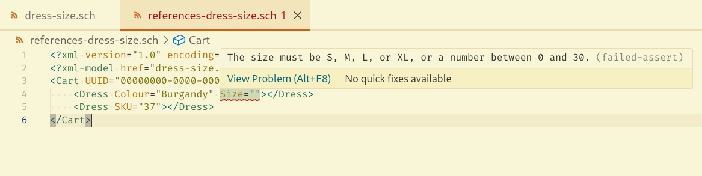

# VS Code Lemminx Schematron

This extension extends Red Hat's vscode-xml with support for validating against Schematron schemas.

Under the hood, it uses schxslt and Saxon-HE in order to perform validation.

This is a proof of concept; it's not supported in any capacity, nor is it official in any capacity.

## Features

### Schematron-based validation

Given the local schema `dress-size.sch`:

```xml
<?xml version="1.0" encoding="UTF-8"?>
<schema xmlns="http://purl.oclc.org/dsdl/schematron">
  <pattern name="Check Cart structure">
    <rule context="Cart">
      <assert test="@UUID">The cart must have a UUID</assert>
      <assert test="count(*) = count(Dress)">Only dresses are allowed in the cart</assert>
    </rule>
  </pattern>
  <pattern name="check uuid">
    <rule context="Cart/@UUID">
      <assert test="string-length(.) = 36">The UUID should be 36 characters long</assert>
      <!-- https://stackoverflow.com/a/12301127 -->
      <assert test="translate(., translate(., '-', ''), '')='----'">The UUID should have 4 hyphens</assert>
    </rule>
  </pattern>
  <pattern name="Check Dress Structure">
    <rule context="Dress">
      <assert test="(@Size and @Colour) or @SKU">Dresses must be identified by their SKU, or by their size and colour</assert>
    </rule>
  </pattern>
  <pattern name="Check Dress Size">
    <rule context="Dress/@Size">
      <assert test="(. = 'S' or . = 'M' or . = 'L' or . = 'XL') or (floor(.) = number(.) and number(.) &gt;= 0 and number(.) &lt;= 30)">The size must be S, M, L, or XL, or a number between 0 and 30.</assert>
    </rule>
  </pattern>
</schema>
```

You can associate this schema to your XML document using the `<?xml-model ...?>` prolog instruction:

```xml
<?xml version="1.0" encoding="UTF-8"?>
<?xml-model href="dress-size.sch" type="application/xml"?>
<Cart UUID="00000000-0000-0000-0000-000000000000">
    <Dress Colour="Burgandy" Size=""></Dress>
    <Dress SKU="37"></Dress>
</Cart>
```

You will get validation based on the Schematron rules:



## Validation of Schematron schemas

If you set the namespace of an XML document to the Schematron namespace
(i.e. you set `xmlns="http://purl.oclc.org/dsdl/schematron"` as an attribute in the root element),
the extension will automatically associate the file with to the two Schematron schemas
from https://github.com/Schematron/schema .
This means that you get validation and completion while editing your Schematron schemas.

## Requirements

- Red Hat's vscode-xml extension
- Java 17 or newer (it doesn't work with the binary mode)

## Known Issues

- Remote schema loading probably doesn't work

## Release Notes

See the [CHANGELOG](CHANGELOG.md)